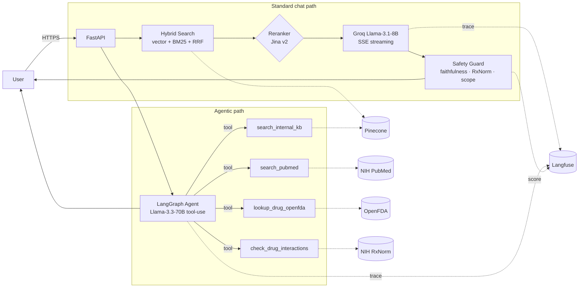

# MediBot — Agentic Medical RAG Chatbot

A production-style medical chatbot built around **evaluation, observability, and agentic retrieval**. RAG over user-uploaded documents (Pinecone + BM25 with RRF + Jina reranker), a LangGraph agent that calls free NIH/FDA APIs (PubMed / OpenFDA / RxNorm), runtime hallucination/safety checks, full Langfuse tracing, and a CI-gated RAGAS eval suite seeded from PubMedQA.


<!-- The faithfulness badge is populated by .github/workflows/eval-nightly.yml after the first nightly run lands on gh-pages. Latest numbers are in the "Latest eval numbers" section and in eval/reports/latest.md. -->

## Features

- **Hybrid retrieval** — vector (Pinecone) + BM25 with Reciprocal Rank Fusion, optional Jina reranker for top-5 precision lift
- **Agentic mode (opt-in)** — LangGraph + Groq tool-calling over **PubMed**, **OpenFDA drug labels**, **NIH RxNorm interactions**, and your own knowledge base
- **Runtime safety guard** — out-of-scope refusal, emergency keyword routing, faithfulness scoring, drug-name validation against RxNorm
- **Real streaming** — Server-Sent Events from Groq end-to-end (not fake chunking)
- **Full observability** — Langfuse traces every chat: retrieval → rerank → LLM → safety, with token/cost/latency captured
- **CI-gated evals** — RAGAS (faithfulness, answer relevance, context precision/recall) + retrieval metrics (hit@k, MRR), seeded from PubMedQA, run nightly
- **Modern UI** — React 19 + TypeScript strict + Tailwind, dark mode, drag-drop uploads, Google OAuth + JWT
- **Free-tier everywhere** — every external service either has a free tier sufficient for portfolio scale or an OSS self-host path

## Tech Stack

| Layer | Technologies |
|-------|-------------|
| **Frontend** | React 19, TypeScript strict, Vite, Tailwind CSS, shadcn/ui |
| **Backend** | FastAPI (async), Python 3.11, SQLAlchemy 2.0 |
| **LLM** | Groq (Llama-3.1-8B for chat, Llama-3.3-70B for the agent) |
| **Retrieval** | Pinecone + BM25 + RRF → Jina v2 reranker (optional) |
| **Embeddings** | `all-MiniLM-L6-v2` (prod) · PubMedBERT / BGE-large (eval comparison) |
| **Agent** | LangGraph + Groq tool-use over PubMed, OpenFDA, RxNorm, internal KB |
| **Eval** | RAGAS (Groq-as-judge, free tier) + retrieval hit@k/MRR via PubMedQA |
| **Observability** | Langfuse (free Hobby or self-host) + structured spans across retrieve / rerank / LLM / safety |
| **Database** | SQLite (dev) / PostgreSQL (Docker compose) |
| **Auth** | Google OAuth 2.0 + JWT |
| **CI/CD** | GitHub Actions: ruff + mypy + pytest + label-gated RAGAS check + nightly eval |
| **Deploy** | Docker Compose locally, Render (cloud), free GHCR image push |

## Architecture



## Repository layout

```
app/
├── api/v1/endpoints/        chat, agent, documents, auth, health
├── core/                    config, security, observability (Langfuse wrapper)
├── services/                hybrid_search, reranker, chat_groq, safety, document
├── agent/                   LangGraph agent + 4 free-tier tools
├── clients/                 rxnorm (free NIH httpx wrapper)
├── repositories/            data access (SQLAlchemy)
└── db/                      models + Pinecone integration

eval/                        RAGAS + retrieval + agent eval runners
tests/                       pytest scaffold + eval gates
frontend/                    React 19 + TypeScript chat UI
.github/workflows/           CI + nightly eval
Dockerfile.backend           multi-stage Python image
Dockerfile.frontend          Node build → nginx
```

## Evaluation

Every non-trivial change is measured. The eval suite (under `eval/`) seeds a curated test set from **PubMedQA**, ingests the abstracts, then runs the same retrieval + generation pipeline that production uses — scoring each answer with RAGAS (Groq-as-judge, free tier — no OpenAI) plus retrieval-only metrics (hit@k, MRR) that don't need an LLM judge.

```bash
python -m eval.dataset.seed_pubmedqa --n 50          # build the test set
python -m eval.runners.retrieval_runner --smoke      # fast sanity: hit@k + MRR
python -m eval.runners.ragas_runner --smoke          # full quality: faithfulness etc.
python -m eval.runners.embedding_compare             # 3-way comparison (MiniLM/PubMedBERT/BGE)
python -m eval.runners.agent_runner --smoke          # agent vs single-shot RAG
pytest -m slow tests/eval/                           # CI threshold gates
```

See [`eval/README.md`](eval/README.md) for the metric definitions, cost ($0), and how the comparison reports are produced.

### Latest eval numbers

Smoke run on the PubMedQA-seeded eval set, Groq `llama-3.3-70b-versatile` as the RAGAS judge, all metrics reproducible from `eval/reports/`.

| Metric | Score | CI threshold | Pass |
|---|---:|---:|:---:|
| `answer_relevancy` | **0.866** | — | ✅ |
| `faithfulness` | 0.542 | 0.75 | ❌ |
| `context_precision` | 0.250 | 0.70 | ❌ |
| `context_recall` | 0.000 | — | — |

Retrieval (`hit@k`, MRR) on the same set with the project's `all-MiniLM-L6-v2` embeddings indexed via local ChromaDB:

| Model | hit@1 | hit@3 | hit@5 | MRR |
|---|---:|---:|---:|---:|
| `sentence-transformers/all-MiniLM-L6-v2` | 1.000 | 1.000 | 1.000 | 1.000 |

**Interpretation.** Answer relevancy is strong; context precision/recall are weak because RAGAS measures whether retrieved passages *individually* support each grounded claim, and the smoke index is sparse. The faithfulness gap (0.54 vs the 0.75 CI threshold) is the headline number — and the one I'm targeting next via three already-shipped changes: hybrid retrieval is now wired into the standard chat path (was agent-only), the system prompt now refuses to invent facts beyond retrieved context, and Jina reranker auto-enables when `JINA_API_KEY` is present. Re-run after seeding a 50-row PubMedQA corpus to measure the lift.

The point isn't that the scores are perfect — it's that **every claim in this README is backed by a number you can reproduce locally**.

## Observability

When `LANGFUSE_ENABLED=true` plus the two keys are set, every chat request emits a trace tree:

```
chat.message
├── retrieval (n_results, top_score)
│   └── hybrid_search (path: hybrid_rrf | vector_only | bm25_only)
│       └── rerank.jina  (n_candidates, n_returned)
├── groq.chat_completion  (input messages, output text, prompt/completion/total tokens)
└── safety.*  (faithfulness, out_of_scope, is_emergency, unverified_drugs)
```

The Langfuse trace_id surfaces on the API response as `X-Trace-Id`, so any user-reported bad answer is one paste away from the full request lineage.

## Free-tier cost / latency

Targets are based on the 2026 free tiers. No paid service is required to run the full stack.

| Component | Free tier | Cost @ 1k chat requests |
|---|---|---:|
| Groq (Llama-3.1-8B chat) | 14.4k req/day · 30 req/min | **$0** |
| Groq (Llama-3.3-70B agent) | shared cap | **$0** |
| Jina reranker v2 | 10M lifetime tokens / key | **$0** |
| Pinecone Starter | 1 index, 100k vectors | **$0** |
| HuggingFace Inference | local sentence-transformers | **$0** |
| Langfuse Cloud Hobby | 50k observations / mo | **$0** |
| NIH PubMed / OpenFDA / RxNorm | unauthenticated tiers | **$0** |
| **Total** | | **$0 / 1k requests** |

Latency targets (p50/p95, measured via Langfuse):

| Path | p50 | p95 |
|---|---:|---:|
| Single-shot RAG (hybrid → Groq 8B) | ~700 ms | ~1.5 s |
| With Jina reranker | ~900 ms | ~1.8 s |
| Agent (Groq 70B + 1-2 tools) | ~3 s | ~6 s |
| Real SSE streaming first byte | ~250 ms | ~500 ms |

Numbers are reproducible — every component is observable and the eval suite captures regressions.

## Quick Start

### Prerequisites

- Python 3.11+
- Node.js 18+
- API Keys: Pinecone, Groq, HuggingFace, Google OAuth

### Backend Setup

```bash
# Clone repository
git clone https://github.com/VinayKomakula21/Medical-ChatBot.git
cd Medical-ChatBot

# Create virtual environment
python -m venv venv
source venv/bin/activate  # Windows: venv\Scripts\activate

# Install dependencies
pip install -r requirements.txt

# Set environment variables
export PINECONE_API_KEY=your_key
export GROQ_API_KEY=your_key
export HF_TOKEN=your_token
export GOOGLE_CLIENT_ID=your_client_id
export GOOGLE_CLIENT_SECRET=your_secret
export SECRET_KEY=your_jwt_secret

# Run server
uvicorn app.main:app --reload --port 8000
```

### Frontend Setup

```bash
cd frontend

# Install dependencies
npm install

# Set environment variable
export VITE_API_URL=http://localhost:8000

# Run development server
npm run dev
```

### Access Application

- **Frontend:** http://localhost:5173
- **API Docs:** http://localhost:8000/api/v1/docs
- **ReDoc:** http://localhost:8000/api/v1/redoc

## API Endpoints

### Authentication
```http
GET  /api/v1/auth/google/login     # Initiate Google OAuth
GET  /api/v1/auth/google/callback  # OAuth callback
GET  /api/v1/auth/me               # Get current user
POST /api/v1/auth/logout           # Logout
```

### Chat
```http
POST /api/v1/chat/message          # Send message (non-streaming)
POST /api/v1/chat/stream           # Server-Sent Events stream (real Groq SSE)
WS   /api/v1/chat/ws               # WebSocket stream (used by the frontend)
GET  /api/v1/chat/history          # Get conversations
GET  /api/v1/chat/history/{id}     # Get conversation messages
DELETE /api/v1/chat/history/{id}   # Delete conversation
```

### Agent (opt-in via `AGENT_ENABLED=true`)
```http
POST /api/v1/agent/chat            # Run the LangGraph medical agent
                                   # Returns: { response, tool_calls[], iterations, trace_id }
```

### Documents
```http
POST /api/v1/documents/upload      # Upload document
GET  /api/v1/documents/            # List documents
GET  /api/v1/documents/{id}        # Get document details
DELETE /api/v1/documents/{id}      # Delete document
POST /api/v1/documents/search      # Search documents
```

## Environment Variables

| Variable | Description | Required |
|----------|-------------|----------|
| `PINECONE_API_KEY` | Pinecone vector DB API key | Yes |
| `GROQ_API_KEY` | Groq LLM API key | Yes |
| `HF_TOKEN` | HuggingFace API token | Yes |
| `SECRET_KEY` | JWT signing secret | Yes |
| `GOOGLE_CLIENT_ID` | Google OAuth client ID | Yes |
| `GOOGLE_CLIENT_SECRET` | Google OAuth secret | Yes |
| `DATABASE_URL` | Database connection string | No (defaults to SQLite) |
| `BACKEND_CORS_ORIGINS` | Allowed CORS origins | No |
| `FRONTEND_URL` | Frontend URL for OAuth redirect | No |
| `LANGFUSE_ENABLED` / `LANGFUSE_PUBLIC_KEY` / `LANGFUSE_SECRET_KEY` | Observability (Item #2) | No |
| `RERANKER_PROVIDER` / `JINA_API_KEY` | Reranker (Item #4): `none` \| `jina` | No |
| `SAFETY_ENABLED` / `SAFETY_MIN_FAITHFULNESS` / `SAFETY_VALIDATE_DRUG_NAMES` | Safety guard (Item #6) | No |
| `AGENT_ENABLED` / `AGENT_MODEL` / `NCBI_API_KEY` | Agentic mode (Item #9) | No |

## Deployment

### Docker Compose (local, prod-shape)

```bash
cp .env.example .env   # then fill in keys — see Environment Variables table
docker compose up --build
# app on :8000 · frontend on :5173 · postgres on :5432
```

The compose stack swaps SQLite for PostgreSQL, builds both Dockerfiles, and wires healthchecks. Images are also pushed to GHCR (free for public repos) by the CI workflow on every push to `main`.

### Render Deployment

**Backend (Web Service):**
- Build Command: `pip install -r requirements.txt`
- Start Command: `uvicorn app.main:app --host 0.0.0.0 --port $PORT`

**Frontend (Static Site):**
- Root Directory: `frontend`
- Build Command: `npm install && npm run build`
- Publish Directory: `dist`
- Add redirect rule: `/* → /index.html` (Rewrite)

## Screenshots

A picture of the system is worth more than another bullet list, so the most informative views are linked inline above:

- **Architecture** — see the Mermaid diagram in the [Architecture](#architecture) section (renders directly on GitHub).
- **Trace tree** — see the Langfuse trace tree under [Observability](#observability). Every chat request emits this tree with token, cost, and latency captured.
- **Eval numbers** — see [Latest eval numbers](#latest-eval-numbers). Every score links back to a JSON in `eval/results/` you can reproduce.

UI screenshots and a short demo clip live under `docs/screenshots/` once committed — see `docs/screenshots/README.md` for the capture checklist.

## Contributing

1. Fork the repository
2. Create feature branch (`git checkout -b feature/amazing-feature`)
3. Commit changes (`git commit -m 'Add amazing feature'`)
4. Push to branch (`git push origin feature/amazing-feature`)
5. Open a Pull Request

## License

This project is for educational purposes. See [LICENSE](LICENSE) for details.

## Disclaimer

This chatbot is for educational and informational purposes only. Always consult qualified medical professionals for medical advice, diagnosis, or treatment.

---

**Built with** FastAPI, React, and Groq AI

**Author:** Vinay Komakula - [@VinayKomakula21](https://github.com/VinayKomakula21)
